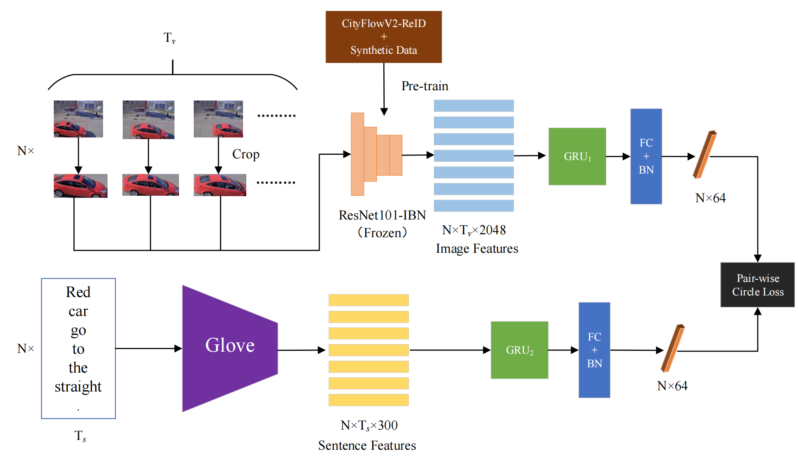

# AICITY2021_Track5_DUN
This repo includes the 2nd place solution for AICity2021 Challenge track5 (Natural Language-Based Vehicle Retrieval) in CVPR2021 Workshop.



# Reproduce the result on AICity 2021 Challenge
## Train
```bash
python model.py
-root dataset_nl/AIC21_Track5_NL_Retrieval
-use_bn
-epoch 80
-train_file dataset_nl/AIC21_Track5_NL_Retrieval/train.pkl
-glove_file 6B.300d.npy
```
```bash
python model2.py
-root dataset_nl/AIC21_Track5_NL_Retrieval
-use_bn
-epoch 60
-train_file dataset_nl/AIC21_Track5_NL_Retrieval/train.pkl
-glove_file 6B.300d.npy
```
```bash
python model2.py
-root dataset_nl/AIC21_Track5_NL_Retrieval
-epoch 100
-train_file dataset_nl/AIC21_Track5_NL_Retrieval/train.pkl
-glove_file 6B.300d.npy
```

## Test
```bash
python model.py
-root dataset_nl/AIC21_Track5_NL_Retrieval
-use_bn
-test
-save_num 1
-test_file dataset_nl/AIC21_Track5_NL_Retrieval/test.pkl
-ckpt lightning_logs/version_1/checkpoints/xx.ckpt
-glove_file 6B.300d.npy
```
```bash
python model2.py
-root dataset_nl/AIC21_Track5_NL_Retrieval
-use_bn
-test
-save_num 2
-test_file dataset_nl/AIC21_Track5_NL_Retrieval/test.pkl
-ckpt lightning_logs/version_2/checkpoints/xx.ckpt
-glove_file 6B.300d.npy
```
```bash
python model2.py
-root dataset_nl/AIC21_Track5_NL_Retrieval
-test
-save_num 3
-test_file dataset_nl/AIC21_Track5_NL_Retrieval/test.pkl
-ckpt lightning_logs/version_3/checkpoints/xx.ckpt
-glove_file 6B.300d.npy
```
```bash
python ens.py
```
You can download our [re-ID feature](https://drive.google.com/drive/folders/1n7-hUWaXtMmoWlQgpxL79aqFXwyTBY1s?usp=sharing)(tran_file and test_file) and [glove pre-trained word vector](https://drive.google.com/file/d/1-eVvsy_8hJJ3xVcxpsbLh1nlTyRG_n15/view?usp=sharing)

You can also retrain the re-ID model to get these two files, please refer to [re-ID](https://github.com/okzhili/AICITY2021_Track5_DUN/tree/main/re-ID)
## Leaderboard
|TeamName|MRR|Link|
|--------|----|-------|
|Alibaba-UTS|0.1896|[code](https://github.com/ShuaiBai623/AIC2021-T5-CLV)|
|**TimeLab(Ours)**|0.1613|[code](https://github.com/okzhili/AICITY2021_Track5_DUN)|
|SBUK|0.1594|code|
